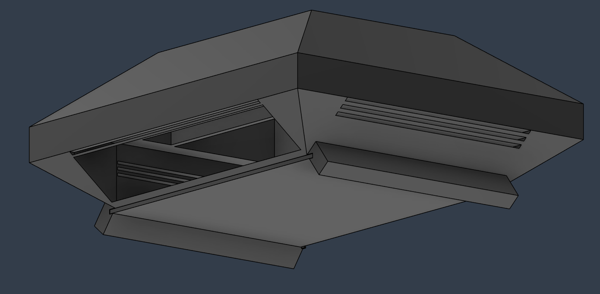
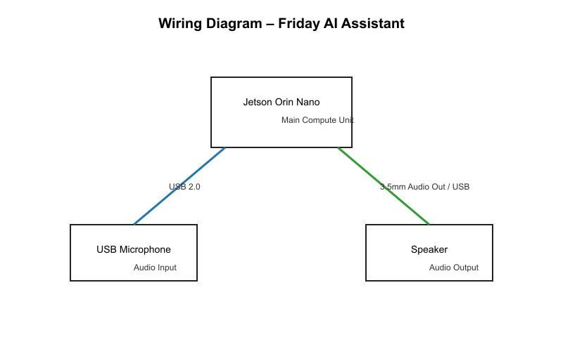

# Friday – AI Desktop Assistant
Friday is a compact AI-powered desktop assistant built using the NVIDIA Jetson Orin Nano. It integrates a microphone and speaker system to allow for voice interaction and local AI processing.
To use Friday, power the Jetson Orin Nano and connect the microphone and speaker. Run the included Python script to run the full ai experience.
I created this project to explore edge AI and build a standalone assistant that does not rely on cloud services. It also helped me learn about hardware integration and embedded systems design.
### Full CAD Assembly

### Wiring Diagram

| Item             | Link                                                                                                     | Quantity | Notes        |
| ---------------- | -------------------------------------------------------------------------------------------------------- | -------- | ------------ |
| Jetson Orin Nano | https://marketplace.nvidia.com/en-us/enterprise/robotics-edge/jetson-orin-nano-super-developer-kit/      | 1        | Main computer |
| Microphone       | https://www.walmart.com/ip/Mini-USB-Recording-Microphone-for-PC-Laptop-Desktop-Computer-Black/5048201368 | 1        | Audio input  |
| Speaker          | https://www.amazon.com/Speaker-Efficiency-Durable-Computer-Innovative/dp/B09H5318TX                      | 1        | Audio output |
| Cable            | https://www.newegg.com/p/1DF-00TY-00099                                                                  | 1        | Connectivity |

* This is an original custom enclosure and system design
* All components are integrated into a complete CAD assembly
* Design has been reviewed and sanity checked
